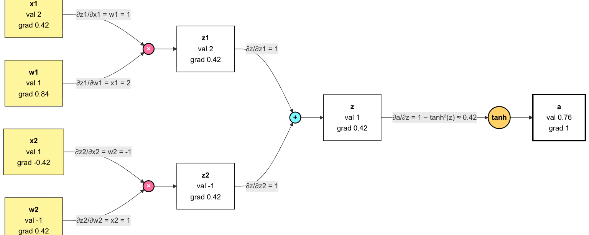
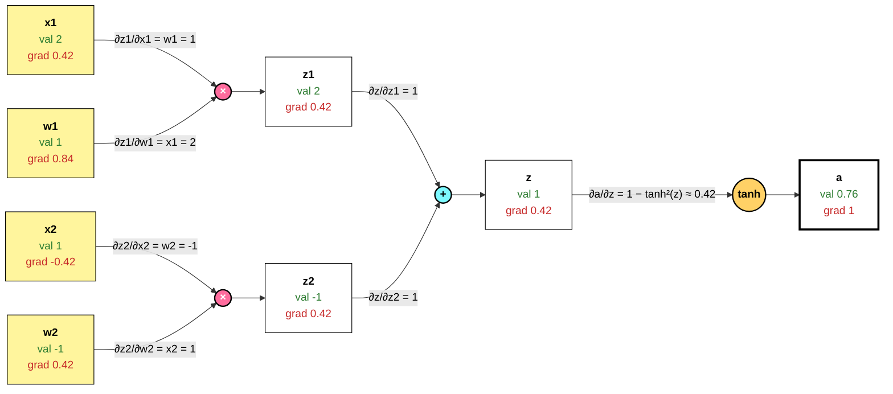

# TorchLite 🔦

An educational toy-project for a Multilayer Perceptron (MLP) built from scratch in modern C++. 

This project implements the foundational mathematics of neural networks without relying on external machine learning libraries. My aim is to learn fundamental C++ concepts by just using standard library implementations.

## Features
* **From-Scratch Implementation**: Core logic for the Network and its Layers built using standard C++.
* **Forward Propagation**: Calculates weighted sums and applies non-linear activation functions (e.g., ReLU).
* **Automatic Differentiation**: (WIP). Inspired by [Andrej Karpathy's micrograd implementation](https://github.com/karpathy/micrograd).

## Backpropagation and Automatic Differentiation (WIP)
In order to train a MLP, we need to tune all parameters within the neutwork: all weights and biases. In supervised learning, we do this based on the error (or _loss_) between the expected output $y$ and the predicted output $\^{y}$. As  This is done using a mechanism called backpropagation.

Performing backpropagation within a MLP is challenging because we need to calculate derivates along the entire chain of layers in the network.

### A quick recap

**What we know**:
* the error or _loss_ between the last expected output $y$ and the predicted output $\^{y}$ in the last layer
* the current values of weights and biases
* the (non-)linear activation functions used on raw values (see below)

**What we don't know (yet):**
* the error or _loss_ between consecutive layers, apart from the second-to-last and last layer (see above)


### How Automatic Differentiation helps and how it's done

**Idea:** Create a graph of all calculations that we are performing through a neural network. This means that - if we consider **one neuron**, it's raw value $z$ and it's activation $a$ - we take all the calculations in the form of $$ x_1 * w_1 + ... + x_n * w_n$$ and create a calculation graph like this:




By traversing this graph from the end, i.e. $a$, to the front, we can backpropagate our final error (that we know) to tune the individual weights (and biases) to train our MLP.

### In more detail: Starting at the end
The first derivative $da/da$ is easy to get as it's by definition just $1$. Traversing back from there, we calculate $da/dz$. For this, we take advantage of the already-derived deriatives of our chosen activation function, whis is a $tanh$, which results in:
$\frac{\partial a}{\partial z} = 1 - \tanh^2(z)$ (cf. [Wikipedia](https://en.wikipedia.org/wiki/Hyperbolic_functions#Derivatives)).

From there, it get's easier again for the next two gradients that we need: $\frac{\partial z}{\partial z1}$ and $\frac{\partial z}{\partial z2}$. As $z = z1 + z2$ is just a simple addition, we'll end up with both local derivatives being $1$.


Forward pro



## Getting Started

### Compilation
```bash
mkdir build
cd build
cmake ..
cmake --build .
```

## Sources and Further Reading
- [Andrej Karpathy's micrograd implementation](https://github.com/karpathy/micrograd)
- [... and his explanation on YouTube](https://www.youtube.com/watch?v=VMj-3S1tku0)
- [Michael Kipp's explanation of Automatic Differentiation (DE)](https://michaelkipp.de/deeplearning/AutomatischeDifferenzierung.html)